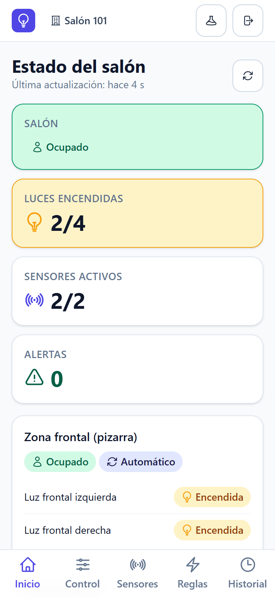
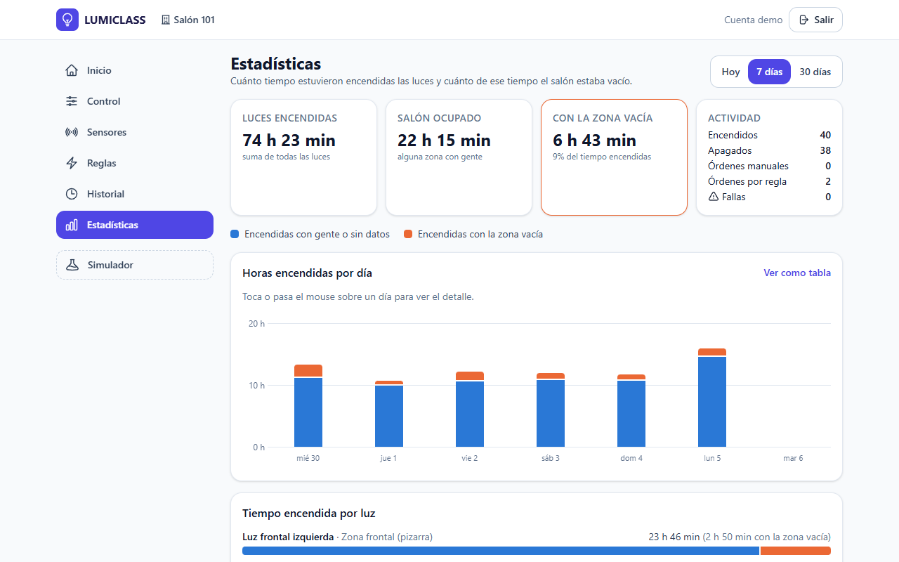
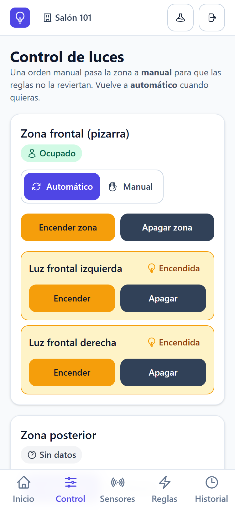
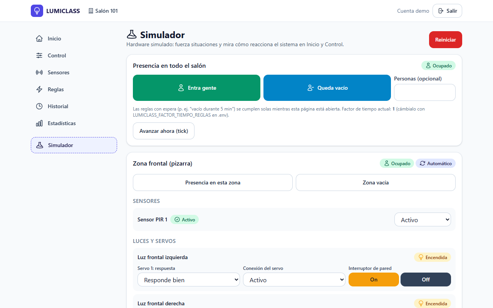

# LUMICLASS

**Sistema inteligente de control y monitoreo de iluminación de un salón de clases.**

LUMICLASS sabe si el salón está ocupado o vacío (sensores de presencia), enciende y apaga las luces moviendo el
interruptor de pared con un servomotor, deja controlarlas a mano desde el celular o el computador, y registra todo:
historial, alertas y estadísticas (incluidas las horas en que las luces quedaron encendidas **con el salón vacío**).
Hoy funciona con **hardware simulado**; la integración con la placa real es la Fase 8.

**Equipo:** Camilo, Marcos y Sofía.

> ⚠️ **Seguridad eléctrica:** los servomotores **solo accionan el interruptor de pared de forma mecánica** (con un
> soporte impreso o de madera). **Nunca** se conectan a la corriente de red (110/220 V). La placa y los servos usan su
> propia fuente de 5 V.

| Celular | Computador |
| ------- | ---------- |
|  |  |
|  |  |

## Qué hace

- **Cuentas:** cada persona se registra y solo ve y controla **sus** salones (puede tener varios).
- **Inicio:** ocupado / vacío, luces encendidas, sensores activos, alertas y estado de cada zona, actualizado cada 3 s.
- **Control:** encender o apagar cada luz o una zona entera; modo **automático** o **manual** por zona.
- **Reglas** editables: "si está ocupado → encender", "si está vacío durante 5 min → apagar", por zona o para todo el salón.
- **Sensores:** conexión, presencia y última lectura.
- **Historial** con filtros y descarga en CSV; **Estadísticas** de 1, 7 y 30 días.
- **Simulador:** forzar presencia, dañar sensores, hacer fallar o demorar servos y simular el interruptor de pared.
- **No se rompe** ante sensores o servos desconectados, servidor caído, datos inválidos, órdenes duplicadas ni
  estados imposibles (ver [docs/PRUEBAS.md](docs/PRUEBAS.md)).

Cada estado se distingue a simple vista con **color + ícono + texto**: amarillo encendida, gris apagada, verde ocupado,
azul vacío, rojo falla, naranja desconocido.

## Requisitos

- [PHP](https://www.php.net/) 8.3 o superior (probado con PHP 8.4 en Windows 11) y [Composer](https://getcomposer.org/) 2.
- [Node.js](https://nodejs.org/) 20 o superior (para compilar la interfaz).
- Git. Opcional: MySQL (por ejemplo el de WAMP); si no, se usa SQLite, que no requiere instalar nada.

## Instalación en Windows

```
git clone https://github.com/MarcoXD23/LUMICLASS.git
cd LUMICLASS
composer install
copy .env.example .env
php artisan key:generate
php artisan migrate --seed
npm install
npm run build
php artisan serve --port=8001
```

Abre **http://localhost:8001** y entra con la cuenta demo (o crea una cuenta):

| Correo                | Contraseña  |
| --------------------- | ----------- |
| `demo@lumiclass.test` | `demo12345` |

La cuenta demo es solo para desarrollo y presentación: cambia su contraseña si el sistema se publica. Cada cuenta nueva
recibe un salón de ejemplo (2 zonas, 4 luces con su servo, 2 sensores PIR y 2 reglas; cantidades **PROPUESTA** hasta
confirmar el salón real).

- **Desde el celular** (misma red WiFi): `php artisan serve --host=0.0.0.0 --port=8001` y abre `http://IP-DEL-PC:8001`
  (la IP sale con `ipconfig`). Si Windows pregunta por el firewall, permite el acceso en redes privadas.
- **Puerto 8001 y cookie `lumiclass_session`:** así LUMICLASS corre al mismo tiempo que otro proyecto Laravel
  (que usa el 8000 y la cookie `laravel_session`) sin mezclar sesiones.

### Base de datos: SQLite o MySQL de WAMP

Por defecto usa **SQLite** (un archivo dentro del proyecto). Para **MySQL de WAMP**: crea la base `lumiclass`
(utf8mb4) y en `.env` usa el bloque MySQL comentado de `.env.example` (puerto 3306 o 3308 según tu WAMP; míralo en el
ícono de WAMP > MySQL). Luego `php artisan migrate --seed`.

> `php artisan migrate:fresh --seed` **borra todos los datos** de la base configurada en `.env`. Revisa `DB_DATABASE` antes de usarlo.

## Para la presentación

```
php artisan lumiclass:demo --zona-horaria=America/Bogota
```

Deja la **cuenta demo** lista: simulador reiniciado, historial limpio y 7 días de **historia de ejemplo** para que
Estadísticas tenga datos (queda marcado en el historial como "Datos de ejemplo cargados"). No toca ninguna otra cuenta.

- Guion paso a paso de la demo (10–12 min): [docs/GUIA_DEMO.md](docs/GUIA_DEMO.md)
- Pruebas para hacer frente al profesor: [docs/GUION_PRUEBAS.md](docs/GUION_PRUEBAS.md)

En `.env`, `LUMICLASS_FACTOR_TIEMPO_REGLAS=0.1` acorta las esperas de las reglas (5 min pasan a 30 s).

## Comandos

| Comando                            | Qué hace                                                      |
| ---------------------------------- | ------------------------------------------------------------- |
| `php artisan serve --port=8001`    | Levanta la aplicación en http://localhost:8001                |
| `npm run build`                    | Compila la interfaz (CSS/JS). `npm run dev` la recompila al editar |
| `php artisan lumiclass:demo`       | Prepara la cuenta demo para presentar                         |
| `php artisan lumiclass:tick`       | Revisa órdenes pendientes de los servos y reglas con tiempo   |
| `php artisan schedule:work`        | (Opcional, otra consola) ejecuta el tick cada 2 s             |
| `php artisan test`                 | Pruebas del backend (no tocan tu base de datos)               |
| `npm run prueba:js`                | Pruebas del JavaScript                                        |
| `npm run prueba:navegador`         | Recorrido completo en Edge/Chrome (con el servidor encendido) |
| `vendor\bin\pint`                  | Formatea el código PHP (`--test` solo revisa)                 |

`php artisan test` y Pint necesitan las dependencias de desarrollo: si instalaste con `composer install --no-dev`,
ejecuta `composer install` antes.

## Problemas frecuentes

| Síntoma | Causa y solución |
| ------- | ---------------- |
| "Failed to listen on 127.0.0.1:8001" | El puerto está ocupado (otra consola con LUMICLASS abierta). Ciérrala o usa otro puerto y cambia `APP_URL`. |
| La página se ve sin estilos o da error "Vite manifest not found" | Falta compilar la interfaz: `npm install` y `npm run build`. |
| Error 500 en todas las páginas con MySQL | Las tablas no existen: `php artisan migrate --seed`. Revisa `storage/logs/laravel.log`. |
| MySQL: "Specified key was too long; max key length is 1000 bytes" | WAMP usa MyISAM por defecto. `config/database.php` ya fuerza InnoDB: actualiza el proyecto y vuelve a migrar (la base debe estar vacía). |
| "La sesión expiró" (419) | La pestaña quedó abierta mucho tiempo. Recarga la página e ingresa de nuevo. |
| Desde el celular no carga | Usa `--host=0.0.0.0`, la IP correcta del PC y la misma red WiFi; permite PHP en el firewall de Windows. |
| Las luces no se apagan solas | La regla espera 5 min de salón vacío. Para la demo, `LUMICLASS_FACTOR_TIEMPO_REGLAS=0.1`. El sistema avanza mientras alguien tenga abierto el dashboard (o con `php artisan schedule:work`). |

## Usar la API desde PowerShell

```powershell
$api = "http://localhost:8001/api/v1"
$json = @{ "Content-Type" = "application/json"; "Accept" = "application/json" }

# Iniciar sesión con la cuenta demo y usar su primer salón
$login = Invoke-RestMethod -Method Post "$api/auth/token" -Headers $json -Body '{"email": "demo@lumiclass.test", "password": "demo12345", "nombre_dispositivo": "PowerShell"}'
$json["Authorization"] = "Bearer $($login.token)"
$salon = (Invoke-RestMethod "$api/salones" -Headers $json).data[0].id

# Entra gente: la regla enciende las luces
Invoke-RestMethod -Method Post "$api/salones/$salon/sim/presencia" -Headers $json -Body '{"presencia": true}'
(Invoke-RestMethod "$api/salones/$salon/estado" -Headers $json).data.luces

# Historial y cerrar sesión (revoca el token)
(Invoke-RestMethod "$api/salones/$salon/eventos" -Headers $json).data | Format-Table fecha, tipo, origen, mensaje
Invoke-RestMethod -Method Post "$api/auth/logout" -Headers $json
```

Todos los endpoints y protecciones: [docs/ARQUITECTURA.md](docs/ARQUITECTURA.md#5-endpoints-apiv1-confirmado).

## Estructura

```
app/         Lógica: controladores, modelos, servicios (luces, reglas, simulador, estadísticas), drivers
routes/      Rutas web y de la API (/api/v1)
database/    Migraciones y seeders
resources/   Vistas (Blade), estilos (Tailwind) y JavaScript (Alpine)
tests/       Pruebas: Feature (PHP), js (Vitest), navegador (Edge/Chrome)
firmware/    Código de la placa (Fase 8)
docs/        Arquitectura, pruebas, guía de demo y guion de pruebas
diseno/      Referencia de Figma (vacía: el diseño actual es propio, PROPUESTA)
```

Documentación técnica: [docs/ARQUITECTURA.md](docs/ARQUITECTURA.md) · Pruebas: [docs/PRUEBAS.md](docs/PRUEBAS.md) ·
Reglas de trabajo del equipo: [CLAUDE.md](CLAUDE.md).

Construido con [Laravel](https://laravel.com) (licencia MIT), Alpine.js y Tailwind CSS.

**Estado:** Fases 1–7, 9 y 10 completadas. Pendiente: Fase 8 (hardware real), cuando se confirmen la placa, los
sensores y los servos.
